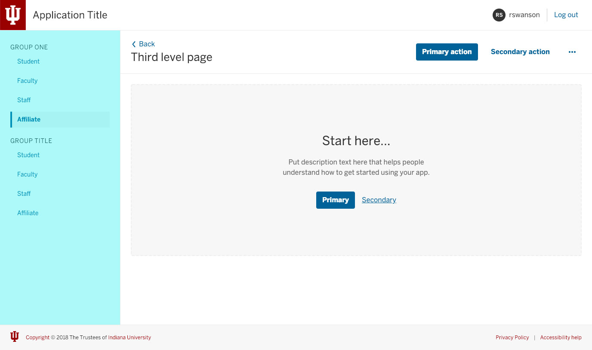
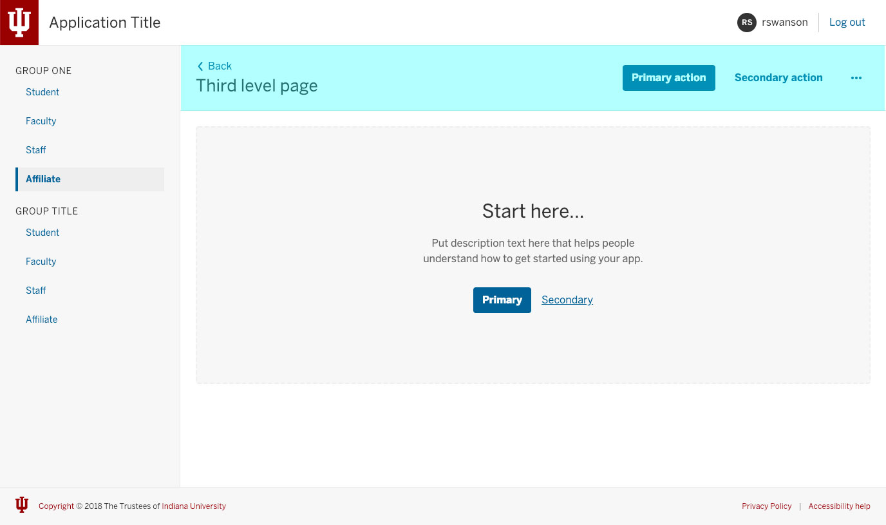

## Shell markup changes
New in 1.0.0—The root `.rvt-shell` class should be applied to the `<main>` element of your document as of version `1.0.0`. See the previous code example for an example of how to structure your markup to include the Rivet header and footer directly before and after the `<main class="rvt-shell">` element.

## Basic shell configuration
The default Rivet layout shell comes ready to use with any of the Rivet header variations and the Rivet footer. The _stage_ area will fill up the remaining vertical space and push the footer to the bottom of the browser window.

Inside the stage are we include a _page header_ component that is used for page/view-specific content. The page header includes:

- A title block
- Breadcrumb navigation
- A dedicated toolbar-like space for actions and links

<a href="./rivet-shell-page-header-only/index.html" class="rvt-button rvt-m-tb-lg">View the basic configuration demo</a>

```html
<header class="rvt-header">
  <!-- Rivet header markup -->
</header>

<main class="rvt-shell">
  <div class="rvt-shell__stage">
    <div class="rivet-page-header">
      <!-- Page header content -->
    </div>
    
    <!-- Rest of your app's main content -->
  </div>
</main>

<footer class="rvt-footer">
  <!-- Rivet footer markup -->
</footer>
```

## Shell sidebar
To offer even more flexibility, the Rivet shell also comes with a sidebar component that can be used to help layout out navigation and content.

### Shell layout on smaller screens
In earlier versions of the shell, we hid the shell sidebar on smaller screens with the idea that developers could duplicate any navigation from the sidebar in the rivet drawer on smaller screens, similar to [how the main Rivet header works](https://rivet.iu.edu/components/navigation/header/#implementation-notes).

As of version 1.0.0 we have removed this functionality and instead the shell sidebar will default to stacking on top of the `rvt-shell__stage` element. Due to the unknown nature of the amount of content that could be placed in the shell sidebar we felt it was better to let the developer have control over how the sidebar content should be handled on smaller screens. For instance if you want to restore the old functionality you could add the following custom CSS:

```css
.rvt-shell__sidebar {
  display: none;
}

/**
 * Referencing Rivet's Sass breakpoint variables:
 * https://rivet.iu.edu/getting-started/sass/#breakpoints
 */
@media screen and (min-width: $breakpoint-md) {
  .rvt-shell__sidebar {
    display: block;
  }
}
```

### Let us know how you are handling sidebar navigation
If you've used the shell and have a responsive solution for showing and hiding the shell sidebar content, please let us know by creating an [issue on the Rivet shell repository](https://github.com/indiana-university/rivet-shell/issues/new).



```html
<main class="rvt-shell">
  <div class="rvt-shell__sidebar">
    <nav role="navigation">
      <ul class="rvt-list-nav">
        <li>Nav item one</li>
        <!-- Rest of navigation -->
      </ul>
    </nav>
  </div>
  <div class="rvt-shell__stage rvt-p-all-md">
    <!-- Main content "Stage" -->
  </div>
</main>
```

<a href="./rivet-shell-sidebar/index.html" class="rvt-button rvt-m-tb-lg">View the sidebar demo</a>

## Sidebar and page header layout
For more complex layouts and navigation structure the shell sidebar and page header can be used together. Building on the _Shell sidebar_ example above, you can place the `rvt-page-header` component included with the shell inside the stage area to make a more complex layout.



```html
<main class="rvt-shell">
  <div class="rvt-shell__sidebar">
    <nav role="navigation">
      <ul class="rvt-list-nav">
        <li>Nav item one</li>
        <!-- Rest of navigation -->
      </ul>
    </nav>
  </div>
  <div class="rvt-shell__stage rvt-p-all-md">
    <div class="rvt-page-header">
      <!-- Page header content -->
    </div>
    <div class="rvt-p-all">
      <!-- Main content "Stage" -->
    </div>
  </div>
</main>
```

In the example above we've used a Rivet spacing utility class to add a bit of padding to the stage content area underneath the page header. We intentionally do not build in padding to the stage so that users have more control over how the content is laid our in the stage area. For example when using the page header.

<a href="./rivet-shell-sidebar-and-header/index.html" class="rvt-button rvt-m-tb-lg">View the sidebar and header demo</a>

## Shell modifiers
There are a couple of different modifiers you can use to modify the shell layout and appearance.

### Reverse modifier
If you are using the shell sidebar, the `rvt-shell--sidebar-right` modifier will move the sidebar to the right side of the shell layout. 

```html
<main class="rvt-shell rvt-shell--sidebar-right">
  <!-- Shell content -->
</main>
```
<a class="rvt-button rvt-m-tb-lg" href="./rivet-shell-right-sidebar-header/">View the reversed layout</a>

### Sidebar and stage modifiers
You can use the `rvt-shell__sidebar--light` modifier to changes the background color of the sidebar to white. This works really will with the `rvt-shell__stage--subtle` modifier which will apply a subtle gray background to the stage, effectively swapping the default colors.

```html
<main class="rvt-shell">
  <div class="rvt-shell__sidebar rvt-shell__sidebar--light">
    <nav role="navigation">
      <ul class="rvt-list-nav">
        <li>Nav item one</li>
        <!-- Rest of navigation -->
      </ul>
    </nav>
  </div>
  <div class="rvt-shell__stage rvt-shell__stage--subtle">
    <!-- Main content "Stage" -->
  </div>
</main>
```

<a class="rvt-button rvt-m-tb-lg" href="./rivet-shell-sidebar-header-reversed-bg/">View the stage and sidebar modifiers</a>

### Compact sidebar list nav modifier
If you have a large amount of navigation in the shell sidebar, you can used the list nav compact modifier to reduce the amount of space between the sidebar nav items.

```html
<main class="rvt-shell">
  <div class="rvt-shell__sidebar">
    <nav role="navigation">
      <ul class="rvt-list-nav rvt-list-nav--compact">
        <li>Nav item one</li>
        <!-- Rest of navigation -->
      </ul>
    </nav>
  </div>
  <div class="rvt-shell__stage">
    <!-- Main content "Stage" -->
  </div>
</main>
```